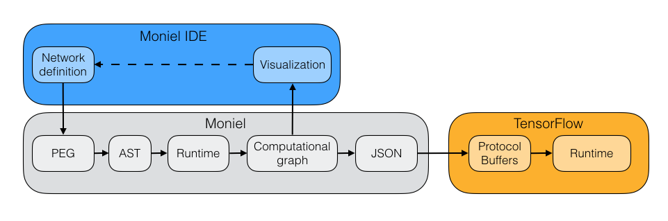

# Overview
## Pipeline

### Moniel
#### PEG
Moniel notation is a [PEG](https://en.wikipedia.org/wiki/Parsing_expression_grammar) language described by the [grammar](../moniel.ohm) and [semantics](../moniel.semantics.js) in [Ohm/JS](https://github.com/cdglabs/ohm).

#### AST
Ohm/JS creates abstract syntax tree that is processed by Moniel runtime which constructs the intermediate representation of computational graph.

#### JSON, Protocol Buffers
TensorFlow uses [Protocol Buffers](https://github.com/google/protobuf) for representing the computational graph. However, one can directly map a special JSON file through ProtoBuf schema to obtain a ProtoBuf definition suitable for TensorFlow runtime.

### Moniel IDE
*Moniel IDE* stands for (Integrated | Interactive) (Development | Design) (Environment | Experience), where user can interactively design model with immediate feedback. For now, this stage is limited to model definition only. However, user should be able to interactively inspect model training and model evaluation – these are partly covered by TensorBoard.
#### Editor
We use [Ace editor customized for Moniel notation](https://github.com/mlajtos/ace-moniel/) with proper syntax highlighting and basic code completion. Thanks to [Fira Code](https://github.com/tonsky/FiraCode) font, various symbols in notation are damn gorgeous.
#### Visualization
To visualize computational graph we use [Dagre](https://github.com/cpettitt/dagre) to layout the graph and [Dagre-D3](https://github.com/cpettitt/dagre-d3) as a bridge to rendering with [D3](https://github.com/d3/d3).